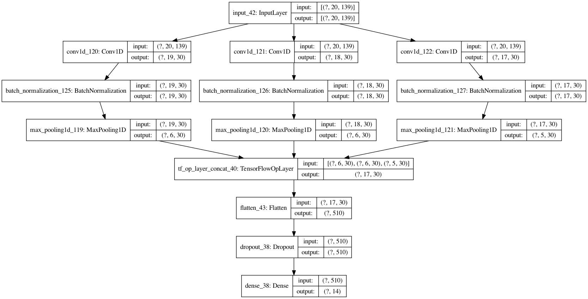

# Character-level POS Tagger

### Problem Statement

Ancient Greek has always been the lesser-taught of the two classical languages (ancient Greek and Latin). Most of the classical language tools, apps, and programs are built specifically for Latin or with ancient Greek as a kind of 'stretch-goal'. In the past decade, NLP has made great strides (digital assistants like Alexa and Siri, bots, Google translate, etc.) and there are a ton of tools out there for processing and modeling modern languages. However, once again, ancient Greek gets none of the NLP love. One of the various things that could be useful for anceint Greek is a machine-learning POS tagger. Currently POS tagging is done with look-up tables which are severely constrained by the size of their table. Ancient Greek has close to 70 million possible unique word-forms, and when a look-up table runs into a word it doesn't have an entry for, it gives you essentially a blank stare. This, of course, isn't the case with machine-learning models. So with this capstone project I attempted to create a POS tagger for highly-inflected languages, specifically ancient Greek. The end end goal is a web app which takes input strings of ancient Greek and performs various processes on it, then returning the output.

### Executive Summary

For this project I used pre-tagged data from <a href="https://universaldependencies.org/" target="_blank">Universal Dependencies</a>, which was then cleaned, tokenized, and vectorized into character-level matrices using Keras with a Tensorflow back-end. Then I trained multiple CNNs on the data, concatenating their outputs before using a Dense layer to predict the POS tag. I then deployed my model to the web using Flask, Gunicorn, and Heroku. The web app takes user input in the form of a string and returns the predicted POS tags.

### Data Collection

The datasource for this project:

-<a href="https://universaldependencies.org/" target="_blank">Universal Dependencies Perseus treebank</a>

Universal Dependencies (UD) is a framework for consistent annotation of grammar (parts of speech, morphological features, and syntactic dependencies) across different human languages. UD is an open community effort with over 300 contributors producing more than 150 treebanks in 90 languages. Found here is the ancient Greek Perseus Treebank with over 202,000 tagged words.

### Data Cleaning

The file format used by UD is CoNLL-U, which required the use of the <a href="https://github.com/pyconll/pyconll" target="_blank">pyconll module.</a> Because this data was already pre-tagged in a consistent format, there was almost no data cleaning required.

### Data Processing (NLP)

The processing of this text was done exclusively with the help of Tensorflow's Tokenizer. First I used pyconll to extract all of the words and their tags. The Tokenizer was then fit on the text data and transformed the data into a character-level one-hot encoded matrix. These matrices were then padded to a maximum length of 20, based of the max word length found in the text. The tags were then passed to a sklearn's LabelBinarizer to make vectors out of the possible tags.

### The Model

The model is a Multi-CNN with three different CNN layers whose outputs were concatenated. 

For testing I used both the validation option within the model parameters (0.2), and used train_test_split(0.2) to have a training, validation, and testing set. An attempt was made to tune hyper-parameters to obtain the lowest variance between the three sets, bringing training accuracy down from 90+ to about 84%. These parameters included:

1. Dropout rate  
2. BatchNormalization  
3. Batch size  

### Conclusions and Recommendations

There are many mistakes that I realized too late to fix in this current iteration, but it works as a proof-of-concept and I have the following goals going forward:

1. Get more data to balance the classes. The classes are horribly unbalanced, but not much could be done about that other than to drop some classes.
2. Words lack context, also use whole sentences. Transfer learning from Word2Vec etc.
3. Fix the padding. Not having padding on both sides of the words means the Convolutional layers were unable to get prefixes.
4. Predict more information. Either use another model to predict specific 'sub-label' classes, or make this one do so.
5. Incorporate input from annotators. Create a feedback loop using the web app to incorporate error reporting from trusted annotators.
6. Try it on other languages. Why not?
7. Make web app pretty. <a href="https://dsir-tagger.herokuapp.com/" target="_blank">Tagger web app</a>
